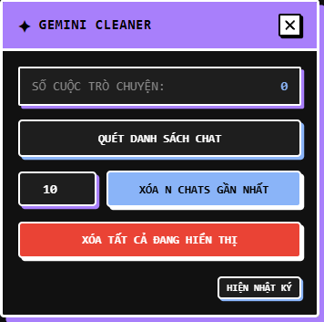

# Gemini Cleaner - Trình Dọn Dẹp Lịch Sử Gemini Tự Động

**Gemini Cleaner** là một tiện ích mở rộng trình duyệt (Manifest V3) giúp bạn tự động hóa việc dọn dẹp hàng loạt các cuộc hội thoại cũ trên Google Gemini. Tiện ích này giải quyết triệt để tình trạng trình duyệt bị giật lag khi lịch sử chat tích tụ quá nhiều sau một thời gian dài sử dụng.

---

## 📸 Giao diện Tiện ích
*(Bạn có thể chèn ảnh chụp màn hình giao diện của tiện ích vào đây dưới tên `screenshot.png`)*

---

## ✨ Các Tính năng Nổi bật

1. **Quét lịch sử thông minh**: Tự động mở rộng thanh bên và cuộn sâu danh sách lịch sử để nạp đầy đủ các cuộc hội thoại cũ (lên tới hơn 350 chats) trước khi dọn dẹp.
2. **Xóa theo số lượng (N chats)**: Nhập số lượng mong muốn (ví dụ: 10, 20, 50) và dọn dẹp nhanh chóng chỉ với 1 click.
3. **Xóa tất cả (Clear All)**: Xóa sạch toàn bộ lịch sử đang hiển thị sau khi đã quét xong (có hộp thoại xác nhận an toàn để tránh nhấn nhầm).
4. **Bảo vệ chống lag**: Tự động nghỉ 450ms - 500ms giữa mỗi lần xóa nhằm đảm bảo giao diện kịp cập nhật, tiến trình chạy mượt mà và không gây quá tải cho tab trình duyệt.
5. **Dừng khẩn cấp (Emergency Stop)**: Bạn có thể nhấn nút "Dừng lại" bất cứ lúc nào để kết thúc tiến trình dọn dẹp ngay sau lượt xóa hiện tại.
6. **Giao diện Neo-Brutalis Glassmorphism**: Thiết kế phẳng, viền trắng cá tính, sử dụng phông chữ monospace chuyên nghiệp. Giao diện panel có dạng mờ kính trong suốt (`backdrop-filter`) sang trọng, giúp bạn vừa thao tác vừa nhìn thấy trang web phía sau.
7. **Ẩn nhật ký (Toggle Log)**: Phần nhật ký hoạt động chi tiết được ẩn mặc định để tiết kiệm diện tích. Bạn có thể nhấn "Hiện nhật ký" để kiểm tra lỗi hoặc xem tiến trình cụ thể bất cứ lúc nào.

---

## 🛠️ Hướng dẫn Cài đặt (Chrome, Edge, Brave, Cốc Cốc)

1. Tải hoặc sao chép thư mục `extensions_deleteChatHistory` về máy tính của bạn.
2. Mở trình duyệt và truy cập trang quản lý Tiện ích mở rộng:
   * Trên **Microsoft Edge**: Truy cập `edge://extensions/`
   * Trên **Google Chrome**: Truy cập `chrome://extensions/`
3. Bật **Chế độ dành cho nhà phát triển** (Developer mode) ở góc trên bên phải màn hình.
4. Nhấp vào nút **Tải tiện ích đã giải nén** (Load unpacked) ở góc trên bên trái.
5. Chọn thư mục `extensions_deleteChatHistory` (thư mục chứa file `manifest.json` này).
6. Biểu tượng **Ngôi sao xanh Cyan Neon** sắc nét của Gemini Cleaner sẽ xuất hiện trên thanh công cụ của bạn!

---

## 🚀 Hướng dẫn Sử dụng

1. Truy cập vào trang web [Google Gemini](https://gemini.google.com/).
2. Nhấp vào biểu tượng **Gemini Cleaner** trên thanh công cụ của trình duyệt để **Hiện/Ẩn** bảng điều khiển (bảng điều khiển sẽ hiện ở góc dưới cùng bên phải màn hình).
3. Nhấp nút **Quét danh sách chat** để tiện ích tự động tải danh sách trò chuyện của bạn.
4. Chọn hình thức dọn dẹp:
   * Điền số vào ô nhập liệu (mặc định là `10`) và nhấn **Xóa N chats gần nhất**.
   * Hoặc nhấp **Xóa tất cả đang hiển thị** để dọn sạch toàn bộ.
5. Ngồi thư giãn để tiện ích tự động click mở menu 3 chấm, nhấp "Xóa" và tự động xác nhận hộp thoại của Gemini cho đến khi hoàn tất!
